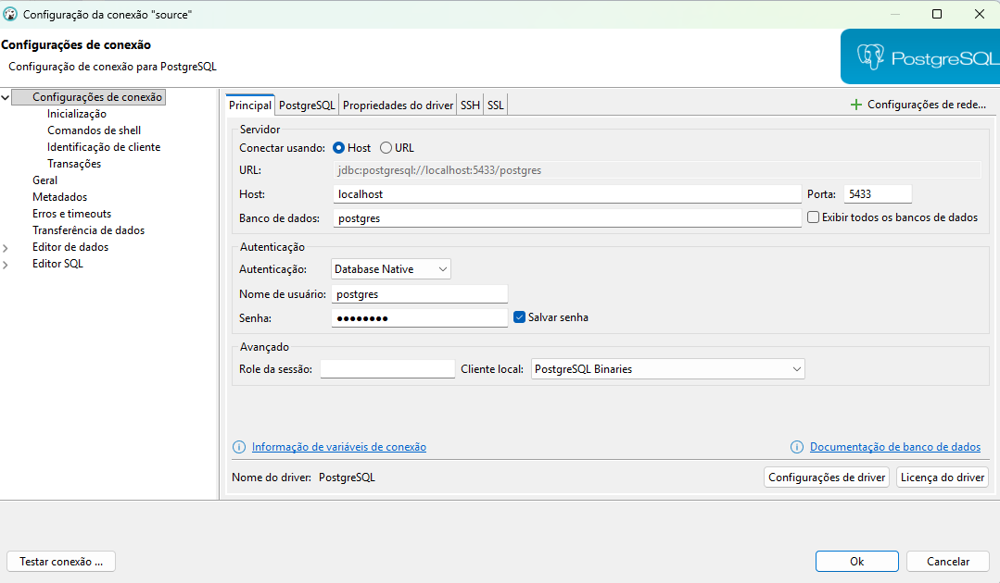
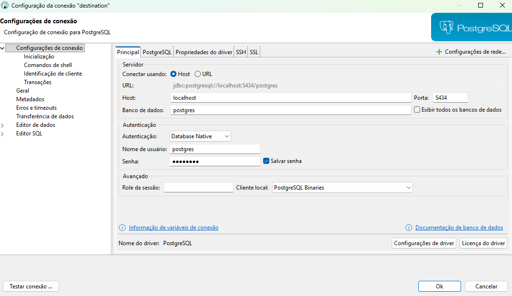
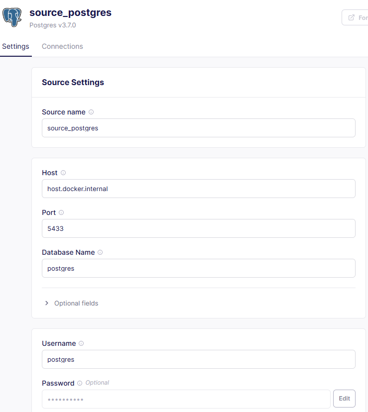
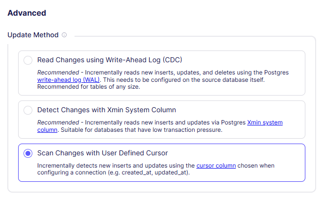
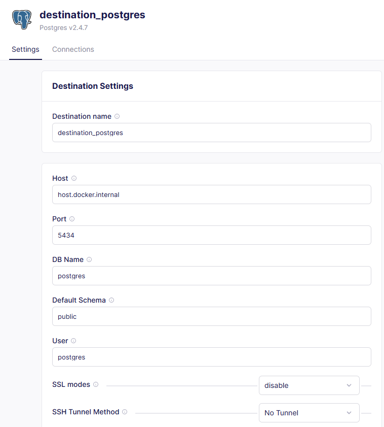
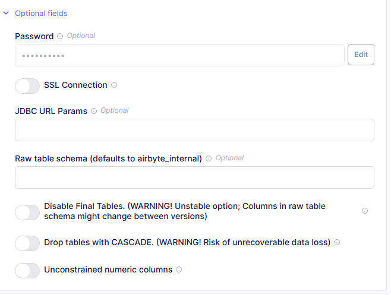
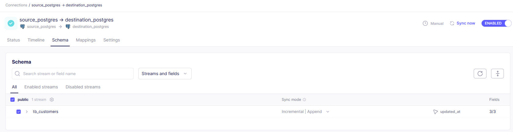
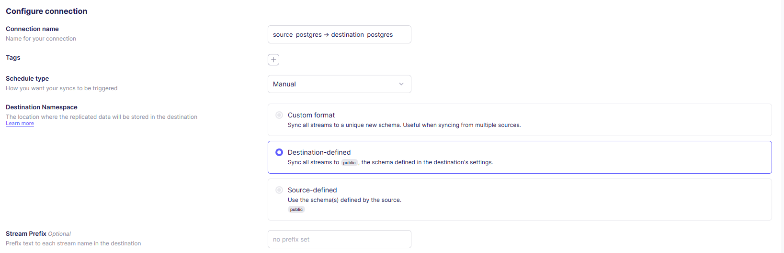
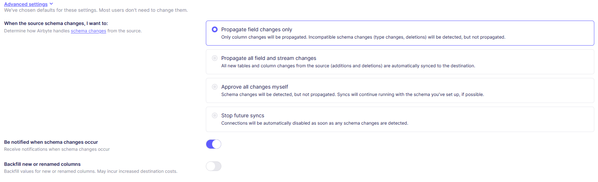
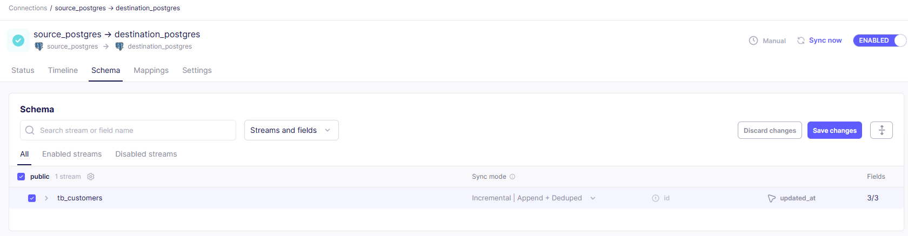

# 🔄 Incremental Sync with Airbyte and Debezium

> **Demonstração prática de Sincronização Incremental usando PostgreSQL e Airbyte**

Este projeto demonstra como implementar uma pipeline de **sincronização incremental** para replicar mudanças de um banco de dados PostgreSQL de origem para um banco de dados PostgreSQL de destino. Utilizamos o **Airbyte** para orquestrar a sincronização dos dados com diferentes modos de sync.

## 🎯 Objetivo

Implementar uma solução de sincronização incremental usando:
- **PostgreSQL**
- **Airbyte** para orquestração e sincronização de dados
- **Docker** para ambiente de desenvolvimento isolado e reproduzível
- **Modos de Sync**: Full Refresh, Incremental Append e Incremental Append + Deduplication

## 🏗️ Arquitetura da Solução

```
┌─────────────────┐     ┌─────────────────┐     ┌─────────────────┐
│   PostgreSQL    │───▶│     Airbyte     │────▶│   PostgreSQL    │
│    (Source)     │ CDC │   (Connector)   │     │  (Destination)  │
└─────────────────┘     └─────────────────┘     └─────────────────┘
      :5433                  :8000                    :5434
```

## 📁 Estrutura do Projeto

```
incremental-sync-with-airbyte/
├── 📄 README.md                 # Documentação do projeto
├── 🐳 dockerfile.source         # Imagem Docker PostgreSQL Source + Debezium
├── 🐳 dockerfile.destination    # Imagem Docker PostgreSQL Destination + Debezium
├── 🐳 docker-compose.yml        # Orquestração do ambiente
├── 📝 LICENSE                   # Licença MIT
├── 🔒 .env                      # Variáveis de ambiente (não versionado)
├── 🗂️ sql/
│   └── 📋 script.sql            # Script de inicialização (executado automaticamente)
└── 🗂️ pics/                     # Screenshots do tutorial
    ├── 🖼️ create_source_connection_dbeaver.png
    ├── 🖼️ create_destination_connection_dbeaver.png
    ├── 🖼️ airbyte_source_configuration_1.png
    ├── 🖼️ airbyte_source_configuration_2.png
    ├── 🖼️ airbyte_destination_configuration_1.png
    ├── 🖼️ airbyte_destination_configuration_2.png
    ├── 🖼️ connection_configuration_1.png
    ├── 🖼️ connection_configuration_2.png
    ├── 🖼️ connection_configuration_3.png
    └── 🖼️ connection_configuration_4.png
```

## 🛠️ Pré-requisitos

### 📋 Ferramentas Necessárias
- **Docker** e **Docker Compose**
- **DBeaver** ou outro cliente SQL
- **Airbyte** (self-hosted ou cloud)

### 🔑 Configuração de Credenciais

Criar um arquivo `.env` na raiz do projeto:

```bash
# PostgreSQL credentials
POSTGRES_PASSWORD=sua_senha_segura
```

## 🚀 Roadmap

### 1️⃣ Configurar o Ambiente Docker

```bash
# Build and start the PostgreSQL containers with Debezium
docker-compose up -d --build
```

> ⚡ **Inicialização Automática:** O script `sql/script.sql` é copiado para `/docker-entrypoint-initdb.d/` e executado automaticamente na **primeira inicialização** do container source, criando:
> - Tabela `tb_customers` com dados de exemplo
> - Function `fn_set_timestamp` para atualizar o campo `updated_at`
> - Trigger `trg_set_timestamp` para disparar a function em updates

### 2️⃣ Criar Conexões com o Banco de Dados

Conecte-se aos bancos PostgreSQL usando DBeaver ou outro cliente SQL:

**🔵 Source Database:**
- **Host:** `localhost`
- **Port:** `5433`
- **Database:** `postgres`
- **Username:** `postgres`
- **Password:** (definido no `.env`)



**🟢 Destination Database:**
- **Host:** `localhost`
- **Port:** `5434`
- **Database:** `postgres`
- **Username:** `postgres`
- **Password:** (definido no `.env`)



### 3️⃣ Acessar o Airbyte

Acesse a interface do Airbyte em `http://localhost:8000` para configurar sources, destinations e syncs.

### 4️⃣ Configurar Source no Airbyte

Configure o PostgreSQL Source como fonte de dados no Airbyte:





### 5️⃣ Configurar Destination no Airbyte

Configure o PostgreSQL Destination como destino dos dados:





### 6️⃣ Configurar Connection no Airbyte

Configure a conexão entre source e destination:







### 7️⃣ Testar a Sincronização Inicial

Verifique os dados no destination e realize updates no source para testar a sync:

```sql
-- Verificar dados e realizar updates no source
UPDATE tb_customers
SET name = 'Carolina'
WHERE id = 2;

SELECT * FROM tb_customers;

UPDATE tb_customers
SET name = 'Fernando'
WHERE id = 1;

SELECT * FROM tb_customers;
```

### 8️⃣ Configurar Modo Incremental

Altere o modo de sync para **Incremental | Append + Deduplication** nas configurações da connection do Airbyte:



### 9️⃣ Testar Sincronização Incremental

Execute operações de UPDATE e INSERT no banco de dados fonte e verifique se as mudanças são replicadas no destino:

```sql
-- Verificar dados no destination
SELECT * FROM tb_customers;

-- Realizar update no source
UPDATE tb_customers
SET name = 'Ana'
WHERE id = 3;

SELECT * FROM tb_customers;

-- Inserir novo registro no source
INSERT INTO tb_customers(id, name)
VALUES (4, 'Zico');

SELECT * FROM tb_customers;
```

## ⚙️ Configurações Principais

### 🐳 Dockerfile Source

```dockerfile
# Use the official Debezium image as base
FROM debezium/postgres:17

# Script SQL é copiado para o diretório de inicialização do PostgreSQL
COPY sql/script.sql /docker-entrypoint-initdb.d/01-init.sql
```

### 🐳 Dockerfile Destination

```dockerfile
# Use the official Debezium image as base
FROM debezium/postgres:17
```

> **Nota:** Scripts em `/docker-entrypoint-initdb.d/` são executados automaticamente apenas na **primeira inicialização** (quando o banco está vazio). Para reinicializar, remova os volumes: `docker-compose down -v`

### 🐘 Docker Compose

```yaml
services:
  db_source:
    build:
      dockerfile: dockerfile.source
    ports:
      - "5433:5432"

  db_destination:
    build:
      dockerfile: dockerfile.destination
    ports:
      - "5434:5432"
```

### 🔧 Script de Inicialização (script.sql)

```sql
-- Create the table with updated_at for incremental sync
CREATE TABLE tb_customers(
  id integer PRIMARY KEY,
  name VARCHAR(200),
  updated_at timestamptz DEFAULT NOW() NOT NULL
);

-- Create trigger to automatically update updated_at
CREATE TRIGGER trg_set_timestamp
    BEFORE UPDATE ON tb_customers
    FOR EACH ROW
    EXECUTE PROCEDURE fn_set_timestamp();
```

## 🔐 Segurança Implementada

- **🔒 Variáveis de Ambiente**: Credenciais gerenciadas via `.env`
- **🛡️ Containers Isolados**: Source e Destination em containers separados
- **📝 .gitignore**: Arquivos sensíveis não versionados

## 🐛 Troubleshooting

### ❌ Script SQL Não Foi Executado
```
Did not find any relation named "tb_customers"
```
**Causa:** O banco já foi inicializado anteriormente (volume persistente).

**Solução:** Remova os volumes e recrie os containers:
```bash
docker-compose down -v
docker-compose up -d --build
```

### ❌ Erro de Conexão no Airbyte
```
Connection refused: host.docker.internal:5433
```
**Solução:** Use o nome do serviço (`db_source` ou `db_destination`) e porta interna (`5432`) se Airbyte estiver no mesmo docker-compose. Ou use `host.docker.internal` com as portas externas.

### ❌ Dados Não Sincronizando Incrementalmente
**Causa:** O campo `updated_at` não está sendo atualizado.

**Solução:** Verifique se o trigger `trg_set_timestamp` está ativo:
```sql
SELECT * FROM information_schema.triggers 
WHERE trigger_name = 'trg_set_timestamp';
```

## 📚 Recursos e Referências

- [📖 Debezium Documentation](https://debezium.io/documentation/)
- [🔄 Airbyte Documentation](https://docs.airbyte.com/)
- [🐘 PostgreSQL Logical Replication](https://www.postgresql.org/docs/current/logical-replication.html)
- [🐳 Docker Documentation](https://docs.docker.com/)

## 🔄 Próximos Passos e Melhorias

- [ ] **🏗️ Terraform**: Infraestrutura como código para cloud
- [ ] **📊 Dashboard**: Monitoramento de métricas de sync
- [ ] **🔒 Vault Integration**: Gerenciamento seguro de secrets
- [ ] **🧪 Testes**: Testes automatizados de integração
- [ ] **📈 Alertas**: Configuração de alertas para falhas de sync
- [ ] **🎯 CDC Mode**: Implementar modo CDC com Debezium connector

## 📞 Suporte e Contato

**Jadeson Bruno**
- 📧 Email: jadesonbruno.a@outlook.com
- 🐙 GitHub: [@JadesonBruno](https://github.com/JadesonBruno)
- 💼 LinkedIn: [Jadeson Bruno](https://www.linkedin.com/in/jadeson-silva/)

---

⭐ **Se este projeto foi útil, deixe uma estrela no repositório!**

📝 **Licença**: MIT - veja o arquivo [LICENSE](LICENSE) para detalhes.
